# How I developed the Geoguessr script
I only made this script to learn how to manipulate websites with userscripts, so I'm sharing what I learnt.

I figured out all this on my own, so there is probably more efficient ways to do this and maybe some inaccurate info

**If after reading this you learn something and have an idea on something you want added to the script, [Submit A pull request](https://github.com/0x978/GeoGuessr_Resolver)**

## How we can fetch the correct coordinates.

### Step 1) Brainstorming an effective, difficult to patch method

First, we need to come up with an effective method for retrieving the coordinates. 

I could just simply use React Props to find the coordinates and be done with it. 

In fact, this worked fine for a very long time, but the developers began to patch out this method by making these properties point to the coordinates of alcatraz on each round...
 - This meant we would constantly guess Alcatraz, rather than the correct location.

We could still use this method, and keep adjusting it each time Geoguessr patched it out, but the nature of retrieving 
these properties mean we would need different methods of fetching coordinates for each game mode (i.e., duels, single player, streaks...)

Thus, we need to try think of ways which we can access the correct coordinates, regardless of game mode, whether the match is ranked and in such a way it is more difficult to patch...

One common thread that we can notice is that **all game modes require the Google Maps API** in order to retrieve the street view image to display to the user.
 - We thus know we have an API request to the Google Maps API we can look at, and see if there is anything interesting.

### Step 2) Observe the API response
If we simply open developer tools network tab when in a game of Geoguessr, we can see a range of API calls.

We can shift through these (or filter) until we find one from the Google Maps API, such as the one below.
 - There will be many API calls to Google Maps, shift through until you find something interesting in one of them...

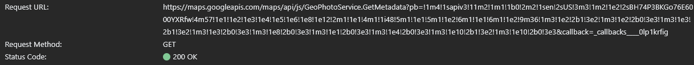

We can now look at the API call, and see if we can pick out anything of interest...

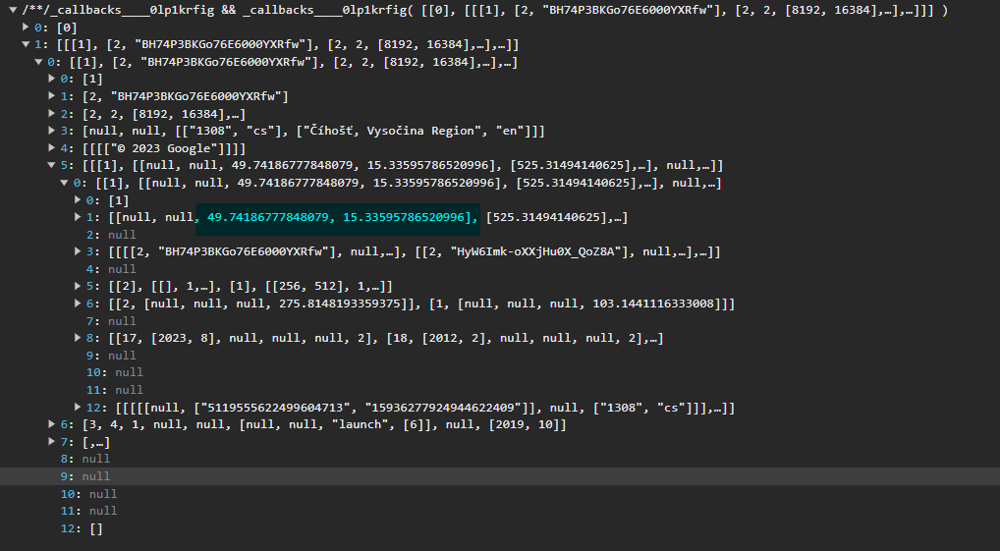

These two highlighted values look like a pair of coordinates, so let's work on extracting them.

### Step 3) Identifying how we could intercept API calls

We can make a good prediction at how Geoguessr is making API calls, a pretty good guess is to look at `XMLHttpRequest`,
who's object can be used to request data from web servers, without refreshing web pages to display it.

We can identify a method on `XMLHttpRequest` called `open` which can be used to create a new request.

We need to *intercept* requests made to the Google Maps API, such that we can read the response from the server.

To do so we can override the `open` function on the `XMLHttpRequest` object, and rewrite it to do what we want.

Consider the following:

```js
var originalOpen = XMLHttpRequest.prototype.open; 
XMLHttpRequest.prototype.open = function(method, url) {
    if (url.startsWith('https://maps.googleapis.com')) {

        this.addEventListener('load', function () {
            let interceptedResult = this.responseText
            const pattern = /-?\d+\.\d+,-?\d+\.\d+/g;
            let match = interceptedResult.match(pattern)[0];
            let split = match.split(",")

            let lat = Number.parseFloat(split[0])
            let lng = Number.parseFloat(split[1])
            globalCoordinates.lat = lat
            globalCoordinates.lng = lng
        });
    }
    // Call the original open function
    return originalOpen.apply(this, arguments);
};
```
Here we have successfully re-written the `open` function to do what we want.

We start by identifying API requests which request URLs point to the Google Maps Api - we are only interested in such API calls.
 - If it doesn't match, we will just allow the original function to be applied.

Next we need to set up an [event listener](https://developer.mozilla.org/en-US/docs/Web/API/EventTarget/addEventListener) on the `XMLHttpRequest` instance (`this` refers to the instance)

We need to find an appropriate event to fire on. [A quick google gives us a valid answer](https://developer.mozilla.org/en-US/docs/Web/API/XMLHttpRequest/load_event).
 - The `load` event runs when the `XMLHttpRequest` transaction has completed successfully, this is the perfect time to check out the response we receive.

Inside the event listener, we can access the response text from the `XMLHttpRequest` instance through the `responseText` property.

We now successfully have the response from the API stored in a variable.

### Step 4) Retrieving the coordinates
Our response text `interceptedResults` contains a lot of text we're not interested in.

We can define a [Regular Expression](https://en.wikipedia.org/wiki/Regular_expression) which will pick out the coordinates.
 - The Regex specifially looks for two pairs (seperated by a `,`) of a series of digits seperated into two parts with a `.` and optionally may be negative.

Our variable `match` now contains the coordinates as a string.

We can split this into an array of two strings, seperated by the comma with `let split = match.split(",")`

We can then identify the latitude and longitude coordinates respectively, and parse them as integers.

Next, we can define a global data structure which can be updated by this eventListener, such that each time a new API request from Google Maps comes in, this is updated.

```js
let globalCoordinates = { 
    lat: 0,
    lng: 0
}
```

And then just simply update it inside the event listener.

```js
            globalCoordinates.lat = lat
            globalCoordinates.lng = lng
```

Finally, with all this defined, we can just call the original `open` function and our event listener will now handle the rest.

## How I made the Duels Guesser feature (PATCHED)

***As expected, this method is now patched. The method we access (`onMarkerLocationChanged`) now restricts (and later bans) your account if you use it.
However, the technique below can still be really useful for any other ideas you have.***

So, Geoguessr uses React for development and design of the website. React stores important information in variables
called “State” (https://react.dev/learn/state-a-components-memory).

Each element on a page is capable of having it’s own state. For example, the map element might have states holding the 
user’s guess location, etc.

It’s using this I can manipulate these states in my favour.

To see an element’s state, we can use developer tools and look for something interesting. “guess-map__canvas-container” 
sounds interesting so we can inspect it further

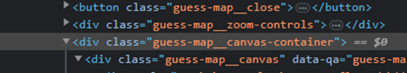

To view the React properties of an element, we can click it and open the “properties” tab in developer tools and look 
for a property starting with “reactFiber”

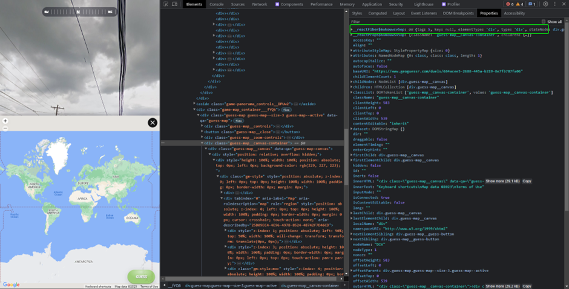

Now we can just look through the React Properties of this element. Anything interesting is usually under the “Return”
and “memoizedProps” headers.

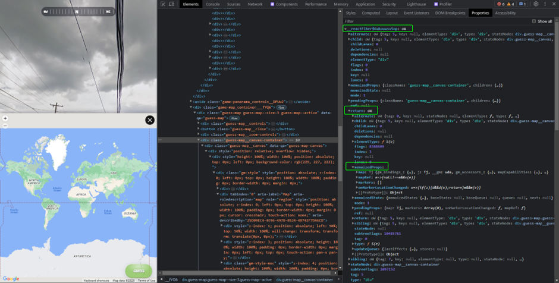

Within the “memoizedProps” there are a couple of properties we can see that might interest us but let’s focus on 
“onMarkerLocationChanged”.

The developer tools tells us this is a function, we can even right click it to view its function definition 
– but this is no use to us since it’s all obfuscated.

From it’s name however, we can conclude that it has something to do with placing a marker on the map 
– the entire aim of Geoguessr. We can probably conclude this is going to be useful.

If we right click this function, we can store it as a “global variable” and test it to see what it does.

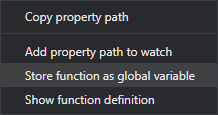

This saves it to the developer tool console, from which we can call it with the name ”temp1"

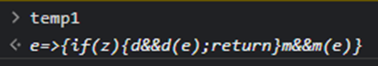

However, calling it does nothing.

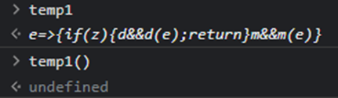

We probably need to pass it some parameters for it to work.

Passing it an empty object "{}" will make it place a marker on the map, but it's just in the middle of the ocean...

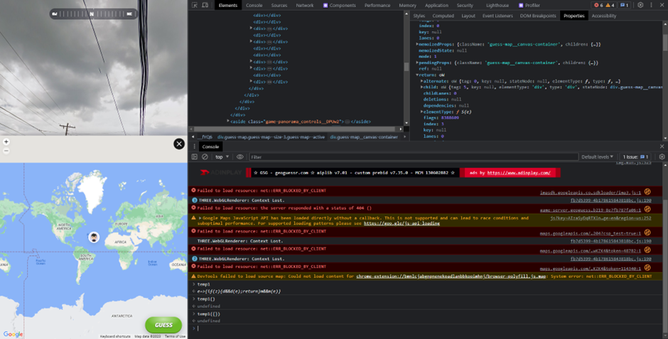

But we can now conclude that it accepts an object.

Using some other code I wrote previously (which uses a similar method), I can get the coordinates from another element’s
react state. I know from this, the coordinates of the right answer are: 11.589896364090123, 122.76240467217586

We can try passing this into the function as an object.

An object needs “keys” which will uniquely be matched to its values (https://www.w3schools.com/js/js_objects.asp)

The keys we will pass will need to match the keys the function is expecting. Since we are dealing with a pair of
coordinates, we can place a safe bet on these keys being called something similar to “lat” and “lng” – for latitude and longitude.

Written out, this leaves us with the following function call:

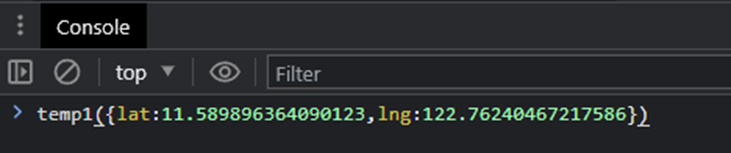

And it was that easy... now we have the marker placed on the correct location in Geoguessr Duels.

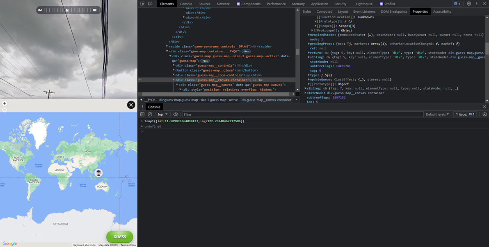

We can just press guess now, and get the location correct.

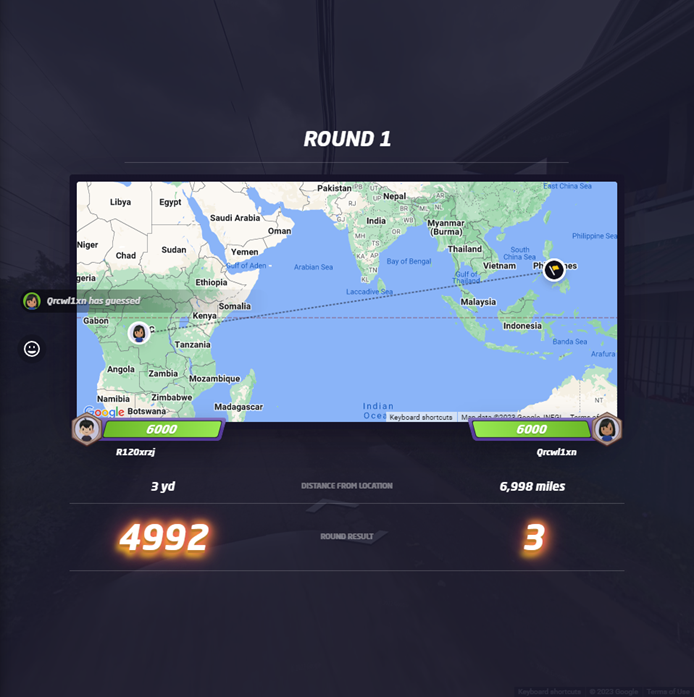

### Putting this into code:

```js
const element = document.getElementsByClassName("guess-map__canvas-container")[0] 
const keys = Object.keys(element)
const key = keys.find(key => key.startsWith("__reactFiber$")) 
const place = element[key].return.memoizedProps.onMarkerLocationChanged
place({lat: lat, lng: lng})
```

The first line is identifying the HTML element containing the props I’m looking for,
this is technically an array of elements matching the class name `guess-map__canvas-container`,
but we’re only interested in the first, so put a [0].

Object.keys() will find all the keys of the html element and stores them in the variable `keys`

From these keys we can identify the key we’re looking for by searching for the one starting with `__reactFiber$`.

Then I just go through the properties until I find the function mentioned earlier, “onMarkerLocationChanged” and save this function as a variable “place”.

Finally, I can just call this function with the lat and lng values identified previous by doing `place({lat: lat, lng: lng})`
where `lat` and `lng` are defined variables containing the latitude and longitude coordinates for the correct answer.
