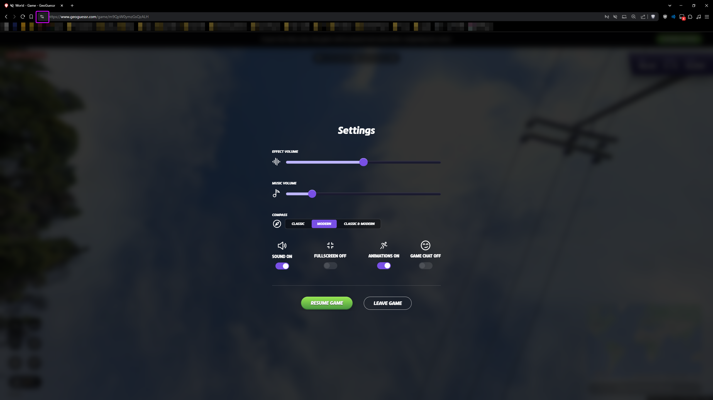
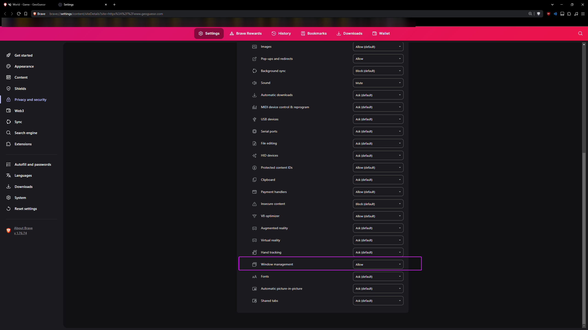
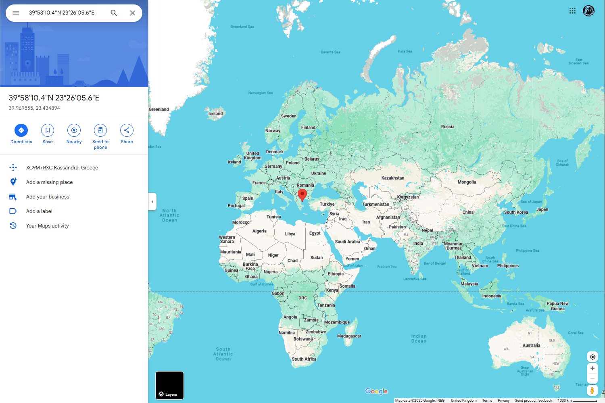
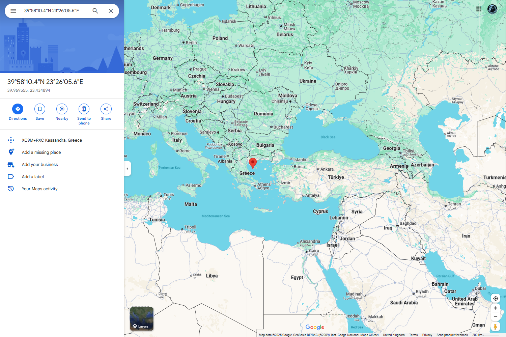
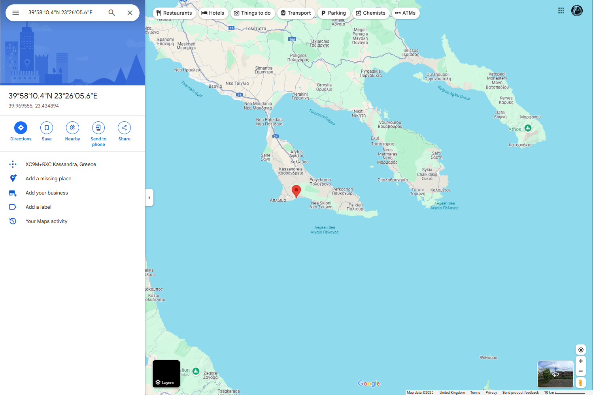

# Opening Google Maps In Second Monitor
I get asked a lot how it might be possible to open Google Maps on a second monitor on key press for when you're screen sharing or whatever

It takes a lot of time to write this individually for each person so here are the instructions, if you're still stuck msg me on dc @qhn

## Step One
In Chrome open these settings (This is Brave Browser but it's basically the same steps)


## Step Two
Click Site Settings


## Step Three
Set `Window Management` to `Allow`


## Step Four
This step depends on the location of your second monitor, we're basically repositioning the window to open so far in one
direction it ends up on your next screen.

Find the line of code which starts `nativeOpen` (at time of writing this is line 146 but will change over time so check)

Replace the entire line with:

```
nativeOpen(`https://maps.google.com/?q=${lat},${lng}&ll=${lat},${lng}&z=5`, '_blank', 'scrollbars=yes,status=yes, top=500, left=1500, width=1500, height=1000');
```

The last four parameters are important and at first seem opposite to what you might expect. View it as applying a margin in that direction:
- Top - number of pixels to move the window down (probably should leave this at 500, it looks about right)
- left - Number of pixels to move the window to the **right** (You can change this value to be `right` instead of left to move the window the other direction)
- Width: Width of window
- Height: Height of window


So if you want to move the window to a monitor to the **right** you should put `left=1500` (roughly, maybe try higher/lower numbers depending on screen size)  

And if you want to move the window to a monitor to the **left** you should put `right=1500` (roughly, maybe try higher/lower numbers depending on screen size) 

The best way to get it perfect for you is just to tweak the numbers until it works for you.

#### Example for moving window to monitor on right
```nativeOpen(`https://maps.google.com/?q=${lat},${lng}&ll=${lat},${lng}&z=5`, '_blank', 'scrollbars=yes,status=yes, top=500, left=1500, width=1500, height=1000');```

#### Example for moving window to monitor on left
```nativeOpen(`https://maps.google.com/?q=${lat},${lng}&ll=${lat},${lng}&z=5`, '_blank', 'scrollbars=yes,status=yes, top=500, right=1500, width=1500, height=1000');```

After these adjustments make sure you save the script then refresh GeoGuessr and it should open on your other screen.
- If still stuck test adjusting the values.
  - If *still* stuck msg me on discord @qhn

## Bonus Setting (Unrelated to second monitor stuff)
You can see in the Google Maps URL there is the string `&z=5` - this dictates the level of zoom the resulting image is.

I have put the default as `z=5` but you can change this to zoom in more or less, where `z=1` is completely zoomed out, and increasing numbers zoom in up to `z=20` which is fully zoomed in on the location.

### z=1


### z=5


### z=10
